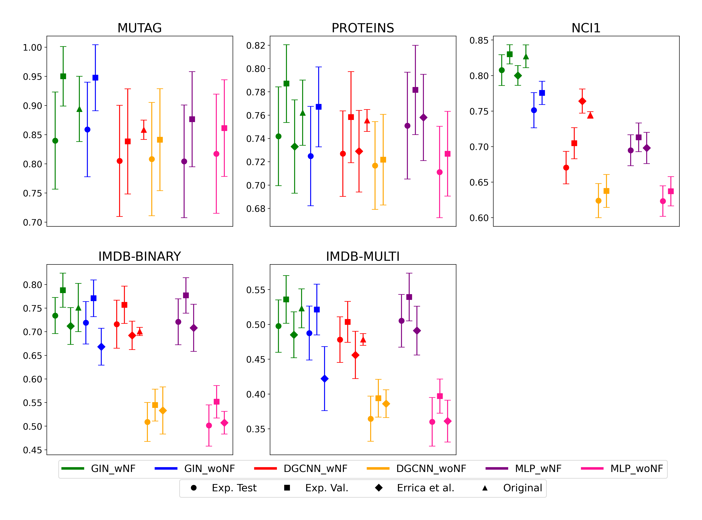
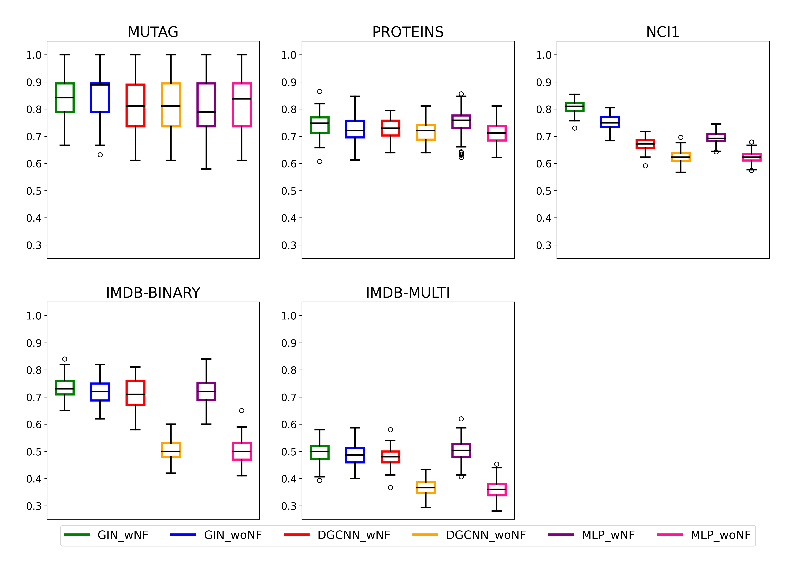

## Helper Scripts for Bachelor Thesis

Thesis: [Leveraging Graph Structure for Graph Classification: An Examination of Graph Neural Networks
](https://github.com/C8XY66/GNN_TrainingFramework/blob/main/Thesis.pdf) 

### Scripts:
* **dot_whiskers_plot.py**: Creates dot and whiskers plot from an Excel file (src/data_dot_whiskers_plot.xlsx).
* **box_plot.py**: Creates box plot including outliers from an Excel file with raw data (src/raw_data_box_plot.xlsx).
* **sqlite_data_evaluation.py**: Calculates averages and standard deviations of data in SQLite database and saves them to an Excel file.
* **sqlite_join_and_convert.py**: Joins the data of multiple SQLite database files in a directory and saves them in an Excel file (src/raw_data_box_plot.xlsx).

### Plots:

**Dot and Whiskers Plot**

**Box Plot**

